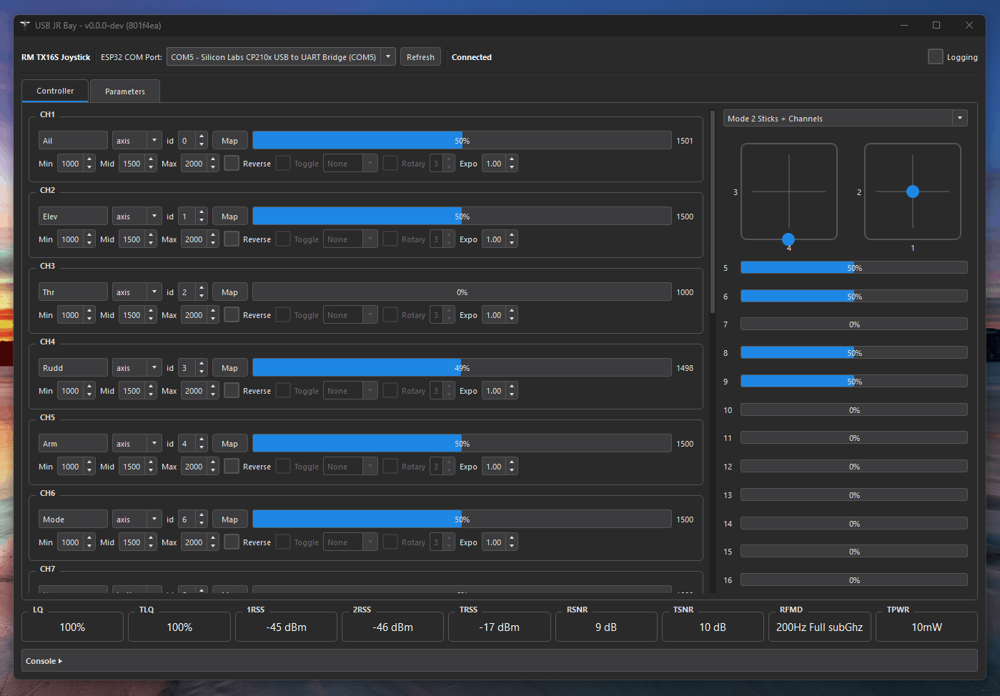

# USB JR Bay

The USB JR Bay application removes the need for an EdgeTX handset as the control interface for TitanLRS (forked from ExpressLRS). With the app running on a laptop, you can use a sim-grade HOTAS, an old Xbox controller, a full yoke-and-switch setup, or any other USB joystick or gamepad as the CRSF input source for a TitanLRS TX module. The app does everything an EdgeTX handset would, providing 16 channels of input mapping, mixer-sync timing, live link statistics, and LUA parameter read and write for both the TX and RX config. The only hardware that is required between the operator's laptop and the TX module is a single USB cable.



## What it does

Sim-grade HOTAS, an old Xbox controller, a throttle quadrant pulled out of a flight school crate. If pygame can see it, USB JR Bay can bind it to any of 16 channels. Axes, buttons, hat switches, and multi-button selectors are all supported.

Every LUA parameter the TX module exposes is browseable and editable from the Parameters tab. That covers packet rate, RF mode, TX power, telemetry ratio, model match, binding phrase, and the rest. Link the TX to a receiver and you'll also get the RX parameters such as RX power, selected protocol, etc. in the Parameters tab.

If joystick frames stop arriving or the USB cable drops, RC transmission halts and the receiver enters failsafe, just like it would if you turned off an EdgeTX handset with the TX in the bay. When the joystick or cable reappears, the app automatically reconnects and transmission resumes automatically.

Full link stats are displayed in real-time on the main dashboard tab for monitoring RF performance. Tick **Log Data** and every channel value plus the full link-stats stream is timestamped into `logs/` at 10 Hz as CSV.

## 3D-printable JR bay

`STLs/` contains a printable tripod mount for the JR bay and a battery (Radiomaster 6.2Ah Lipo)

## Running it

Requires Python 3.9 or newer, a USB joystick or gamepad, and a TitanLRS TX module running the latest firmware version.

The easiest way to run the app is to download the pre-built binary for your OS from the Releases tab on Github (Windows .exe, macOS .app, or Linux binary).

Alternatively, you can run from the CLI in python using:

```powershell
cd tools/feeder
pip install -r requirements.txt
python feeder.py
```

Pick the TX's COM port from the dropdown at the top of the window.

First-run setup is the obvious order: pick a port, connect a joystick, hit **Map** on each channel row and move the axis or press the button you want bound to it, then set min/center/max/expo to taste. The **Parameters** tab will populate once the TX is talking.

## Building an executable

CI builds Windows, macOS (Intel and Apple Silicon), and Linux binaries on every push, and attaches them to the release when a `v*` tag is pushed.

To build locally, from `tools/feeder`:

```powershell
# Windows
pyinstaller --onefile --windowed --icon="icon.ico" --add-data "icon.ico;." --name="USB_JR_Bay" feeder.py
```

```bash
# macOS / Linux (drop --icon on Linux; macOS needs pillow installed to convert the .ico)
pyinstaller --onefile --windowed --icon="icon.ico" --add-data "icon.ico:." --name="USB_JR_Bay" feeder.py
```

Windows gets `dist/USB_JR_Bay.exe`, macOS gets `dist/USB_JR_Bay.app`, Linux gets `dist/USB_JR_Bay`.

## Repo layout

```
tools/feeder/     PyQt5 app: CRSF protocol, serial transport, joystick input, parameter UI
STLs/             3D-printable desktop JR bay and tripod mount
docs/             Project notes
```

## Safety

This drives a real radio talking to a real receiver, so the usual rules apply:

- Bench-test failsafe end-to-end. Unplug the joystick, pull the USB cable, kill the app, and verify what the UAV firmware does in each case.
- The receiver-side failsafe profile is configured separately. USB JR Bay can stop sending channels, but the UAV firmware decides what the aircraft does about it.
- Use at your own risk.
